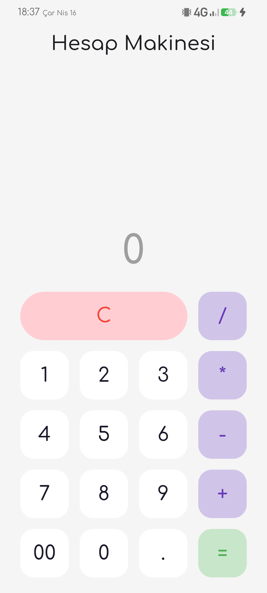

# Calculator App 🧮

This is a simple calculator app made with **Flutter**.  
It has a clean design and does basic math operations like addition, subtraction, multiplication, and division.

## ✨ Features

- Add, subtract, multiply, divide  
- Easy to use  
- Clear button to reset  
- “00” button for quick input  
- Nice and minimal UI

## 📱 Screenshot

  
  &nbsp;
  

## 🛠️ Technologies

- Flutter  
- Dart

## 👨‍💻 Developer

**Mehmet Emin Güler**  
📧 Email: [mhmt.eminguler@gmail.com](mailto:mhmt.eminguler@gmail.com)  
💻 GitHub: [github.com/meminglr](https://github.com/meminglr)

